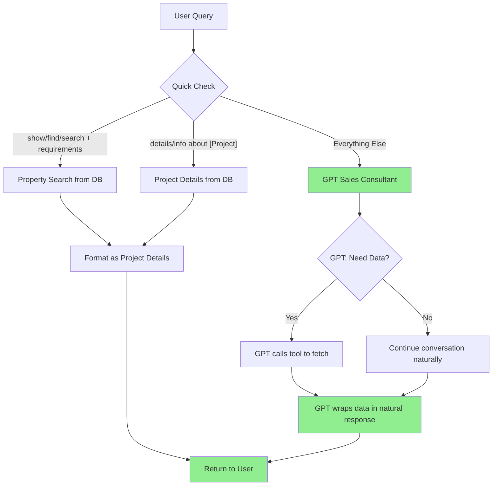

# Analysis: Why Conversation Isn't ChatGPT-Like

## Current Problem

The app has **TOO MANY RIGID INTENT HANDLERS** that break the natural conversation flow. Instead of acting like a sales consultant, it acts like a form-filling bot with specific handlers for each scenario.

## Current Architecture (BROKEN FOR CONTINUOUS CONVERSATION)

### Key Problems:

1. **Too Many Rigid Handlers** (7+ different intent handlers)
2. **Each handler returns specific response types** (not conversational)
3. **No unified GPT layer** for sales consultant behavior
4. **Database queries** break conversation flow
5. **Context switching** between handlers loses conversation thread

## What ChatGPT Does (What We Should Do)

### ChatGPT Approach:

1. **Single GPT layer** acts as sales consultant
2. **GPT decides** when to fetch data vs continue conversation
3. **GPT wraps ALL responses** in natural language
4. **Context maintained** across all interactions
5. **No rigid intent switching**

##User's Requirements (Crystal Clear)

### ✅ Should Use Database:
1. **Property suggestions with requirements**
   - "show me 2bhk" → Query DB → Show projects
   - "properties in whitefield under 2cr" → Query DB → Show projects

2. **Project information requests**
   - "details about Avalon" → Fetch Avalon from DB → Show details
   - "Brigade Citrine amenities" → Fetch from DB → List amenities

### ✅ Should Use GPT Sales Consultant:
**EVERYTHING ELSE** - All other queries should flow through a **unified GPT sales consultant** that:
- Maintains continuous conversation
- Handles objections naturally
- Answers FAQs conversationally
- Provides investment advice
- Discusses locations, appreciation, EMI
- Asks follow-up questions naturally
- Builds rapport
- Guides toward site visit
- **NEVER asks clarifying questions unnecessarily**
- **Uses context from previous messages**

## Examples of Current vs Desired Behavior

### Example 1: Property Search (Should Use DB) ✅

**Query**: "show me 2bhk in whitefield under 2cr"

**Current**: ✅ Works - Shows properties from DB
**Desired**: ✅ Same - Continue showing properties from DB

---

### Example 2: Project Details (Should Use DB) ✅

**Query**: "tell me about Brigade Avalon"

**Current**: ✅ Works - Shows Avalon details
**Desired**: ✅ Same - Continue showing project info from DB

---

### Example 3: General Conversation (Should Be GPT) ❌

**Query**: "What's the expected appreciation in Whitefield?"

**Current**: ❌ Tries to classify as specific intent → May show properties or give scripted response
**Desired**: ✅ GPT sales consultant answers naturally: "Whitefield has been showing steady 8-10% appreciation annually due to IT corridor expansion. The upcoming metro phase 2 is expected to further boost values..."

---

### Example 4: Objection Handling (Should Be GPT) ❌

**Query**: "It's too expensive for me"

**Current**: ❌ Routes to `sales_objection` handler → Scripted objection response
**Desired**: ✅ GPT sales consultant handles naturally: "I understand budget is a concern. Let me help you with that - we can explore options like extended payment plans, or I can show you similar properties in emerging areas like Sarjapur that offer better value. What would you prefer?"

---

### Example 5: Follow-up Questions (Should Be GPT) ❌

**Query**: [After showing projects] "What about the ROI?"

**Current**: ❌ May classify as `more_info_request` or `sales_faq` → Disconnected response
**Desired**: ✅ GPT continues conversation: "Great question! For the projects I just showed you, especially Brigade Citrine in Whitefield, you're looking at 10-12% appreciation over the next 3-5 years. Plus rental yields of 3-4%. The key drivers are..."

---

### Example 6: Vague Follow-ups (Should Be GPT) ❌

**Query**: [After discussing Avalon] "give more points"

**Current**: ❌ May work with context enrichment, but still routes to specific handler
**Desired**: ✅ GPT naturally continues: "Absolutely! Beyond what I mentioned, Brigade Avalon offers:
- IGBC Gold certified (saves 30% on power bills)
- Only 15 mins from ITPL tech park
- Possession in Q2 2025 - perfect timing
- Developer has 99% on-time delivery track record
Would you like to see the payment plan or schedule a site visit?"

---

## Solution Architecture

### Proposed Flow:

### Implementation Strategy:

#### 1. **Minimal Intent Classification**
Only classify into 3 categories:
- `property_search` - Explicit search requests
- `project_details` - Explicit project info requests
- `sales_conversation` - **EVERYTHING ELSE** → Route to GPT

#### 2. **Unified GPT Sales Consultant**
- Acts as senior sales advisor
- Has access to tools (DB fetch, project info)
- Maintains conversation context automatically
- Handles objections, FAQs, follow-ups naturally
- Never asks "what are you looking for?" if context exists

#### 3. **Tool-Based Data Fetching**
- GPT decides when to fetch data
- GPT calls tools: `search_properties()`, `get_project_details()`
- GPT wraps responses naturally

#### 4. **Session Context Always Available**
- Every GPT call gets full conversation history
- GPT sees: previous messages, interested projects, objections, filters
- GPT continues conversation seamlessly

## Benefits of This Approach

### Current System:
- ❌ 7+ different handlers
- ❌ Rigid intent switching
- ❌ Scripted responses
- ❌ Context loss between handlers
- ❌ Feels robotic

### New System:
- ✅ 3 simple routes (search/details/conversation)
- ✅ Unified GPT consultant
- ✅ Natural conversation flow
- ✅ Context preserved always
- ✅ Feels like ChatGPT + real estate expert

## Implementation Priority

### High Priority (Must Have):
1. Route 90% of queries to unified GPT sales consultant
2. Keep only explicit search/details as separate handlers
3. Give GPT access to conversation context always
4. Remove scripted responses for objections/FAQs

### Medium Priority (Should Have):
5. Add tool-calling for GPT to fetch data when needed
6. Improve context injection for better continuity

### Low Priority (Nice to Have):
7. Fine-tune GPT prompts for sales excellence
8. Add memory across sessions (long-term customer history)

---

**TLDR**: The app has too many rigid handlers. ChatGPT works because it's a single unified AI that decides what to do. We should:
1. **Keep DB handlers** for explicit searches and project details
2. **Route everything else** to a unified GPT sales consultant
3. **Let GPT maintain** continuous conversation naturally
