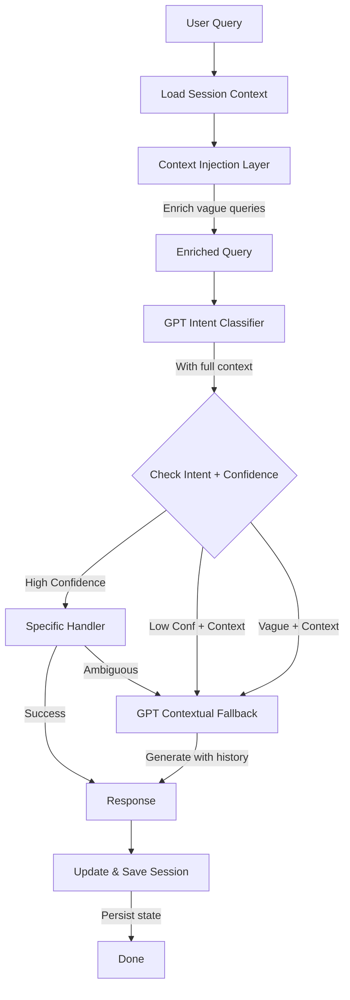

# Continuous Conversation Implementation - Complete ✅

## Overview
Successfully implemented continuous conversation flow to prevent the chatbot from asking repetitive clarifying questions. The chatbot now maintains context across turns and naturally continues conversations using session history.

## What Was Changed

### 1. Enhanced Session Manager ✅
**File**: `backend/services/session_manager.py`

**Changes**:
- Added `last_topic` and `conversation_phase` tracking to `ConversationSession` model
- Added `last_shown_projects` list to track recently displayed properties
- Implemented `save_session()` method for proper state persistence
- Created `get_context_summary()` method that returns rich context for GPT
- Added `_format_context_for_gpt()` helper to create natural language context summaries

**Impact**: All conversation state is now properly preserved and accessible across turns.

---

### 2. Created Context Injection Service ✅
**File**: `backend/services/context_injector.py` (NEW)

**Purpose**: Enriches vague queries with session context before processing

**Key Functions**:
- `is_vague_query()`: Detects queries that need context enrichment
- `has_explicit_project_mention()`: Checks if project is already mentioned
- `enrich_query_with_context()`: Transforms "give more points" → "give more points about Brigade Citrine"
- `inject_context_metadata()`: Creates metadata dict with full context
- `should_use_gpt_fallback()`: Determines when to skip handlers and use GPT directly

**Example**:
```python
# Before: "give more points"
# After: "give more points about Brigade Citrine" (if Citrine was last discussed)
```

---

### 3. Upgraded GPT Intent Classifier ✅
**File**: `backend/services/gpt_intent_classifier.py`

**Enhancements**:
- Now accepts `context_summary` parameter from session manager
- Uses last 10 conversation turns (up from 5) for better context
- Updated system prompt to NEVER return "ambiguous" if session context exists
- Added context-aware classification instructions
- Forces `more_info_request` intent for vague queries with project context

**System Prompt Addition**:
```
**IMPORTANT - Context-Aware Classification:**
- If session context shows a project is being discussed, NEVER classify as "unsupported" or "ambiguous"
- For vague follow-ups (e.g., "give more points") with project context → classify as "more_info_request" with HIGH confidence
- Use conversation history to infer intent - don't mark as unclear if context makes it clear
```

---

### 4. Added Intelligent GPT Fallback ✅
**File**: `backend/services/gpt_content_generator.py`

**New Function**: `generate_contextual_response_with_full_history()`

**Purpose**: Ultimate fallback that NEVER asks clarifying questions

**Features**:
- Uses full conversation history (last 10 turns)
- Includes session context (projects, topics, filters, objections)
- System prompt explicitly forbids clarifying questions
- Continues conversations naturally using context

**System Prompt Instruction**:
```
**YOUR CRITICAL INSTRUCTIONS:**
1. NEVER ask clarifying questions like "What would you like to know?" or "Could you clarify?"
2. Use the conversation context to infer what the user wants
3. Continue the conversation naturally as if you fully understand the context
4. If the user asks vague questions like "give more points", provide relevant information about the current topic/project
```

---

### 5. Updated Main Chat Endpoint ✅
**File**: `backend/main.py` (`/api/chat/query`)

**Major Changes**:

#### Before Intent Classification:
1. Load session and get context summary
2. Enrich vague queries with context using `context_injector`
3. Create context metadata for handlers

#### After Intent Classification:
1. Check if GPT fallback should be used (`should_use_gpt_fallback()`)
2. If yes, bypass specific handlers and go straight to contextual GPT
3. For unsupported intents with context, use contextual fallback instead of generic response

#### Session Updates:
- Save session after EVERY response with updated state
- Track `last_intent` and `last_topic` consistently
- Record interested projects automatically

**Code Flow**:
```python
# Step 0.5: Load session context
session = session_manager.get_or_create_session(request.session_id)
context_summary_dict = session_manager.get_context_summary(request.session_id)

# Step 0.6: Enrich vague queries
enriched_query, was_enriched = enrich_query_with_context(request.query, session)

# After classification: Check for GPT fallback
if should_use_gpt_fallback(original_query, session, gpt_confidence):
    response_text = generate_contextual_response_with_full_history(...)
    # Update and save session
    session.last_intent = intent
    session_manager.save_session(session)
    return response
```

---

### 6. Fixed Flow Engine Clarification Loops ✅
**File**: `backend/services/flow_engine.py`

**Changes in NODE 2A**:
- When `intent == "request_info"` AND `state.selected_project_name` exists:
  - Use `generate_contextual_response()` instead of asking "What would you like to know?"
- When `intent == "ambiguous"`:
  - Check if we have `state.last_shown_projects`
  - If yes, use GPT with context instead of generic clarification
  - Only fall back to generic question if NO context exists

**Changes in NODE 2B_WAIT**:
- When no project selected but `state.last_shown_projects` exists:
  - Show list of available projects instead of generic "Which project?"

**Before**:
```python
else:
    # Ambiguous or unclear intent
    action = "I'd be happy to help you further! Would you like to know more..."
```

**After**:
```python
else:
    # Ambiguous - Use context if available
    if state.selected_project_name or state.last_shown_projects:
        action = generate_contextual_response(user_input, context, goal)
    else:
        action = "I'd be happy to help you further..."
```

---

### 7. Enhanced Intelligent Sales Handler ✅
**File**: `backend/services/intelligent_sales.py`

**Changes**:

#### Method Signature Updates:
- `generate_intelligent_response()`: Added `conversation_history` parameter
- `handle_query()`: Added `conversation_history` parameter

#### UNKNOWN Intent Handling:
**Before**: Immediately fallback to RAG
**After**: 
1. Check if session has context
2. If yes, use `generate_contextual_response_with_full_history()` with conversation history
3. Only fallback to RAG if no context exists

**Code**:
```python
if intent == SalesIntent.UNKNOWN:
    if session_id and self.session_manager:
        session = self.session_manager.get_or_create_session(session_id)
        
        if len(session.messages) >= 2 or session.interested_projects:
            # Use GPT with context
            response = generate_contextual_response_with_full_history(
                query=query,
                conversation_history=conversation_history,
                session_context=context_summary,
                goal="Continue the sales conversation naturally"
            )
            return response, intent, False, actions
    
    # No context - fallback to RAG
    return "", intent, True, []
```

#### Main.py Integration:
- Updated calls to `intelligent_sales.handle_query()` to pass `conversation_history`
- Applied in both `sales_faq` and `sales_objection` handlers

---

## Key Principles Implemented

1. ✅ **Never Ask Clarifying Questions**: If context exists, use it
2. ✅ **Context Injection First**: Enrich queries BEFORE classification
3. ✅ **GPT as Safety Net**: When in doubt, GPT with context is better than asking
4. ✅ **Session Persistence**: Save state after EVERY turn
5. ✅ **Conversation Continuity**: Track topic transitions naturally

---

## Expected Behavior Change

### Before (Repetitive Questions):
```
User: "Show me projects in Whitefield"
Bot: [Shows Brigade Citrine, Avalon, Neopolis]

User: "give more points"
Bot: "Could you please clarify what specific information you're looking for? 
     I'm here to help with any real estate queries you have."
```

### After (Natural Continuation):
```
User: "Show me projects in Whitefield"
Bot: [Shows Brigade Citrine, Avalon, Neopolis]

User: "give more points"
Bot: "Here are more compelling points about Brigade Citrine:

✨ **Prime Location Advantages:**
- Located in the heart of Whitefield IT corridor
- 5 min to ITPL, 10 min to Marathahalli
- Upcoming metro station within 2km

💰 **Investment Potential:**
- Area has seen 15% appreciation annually
- High rental demand from IT professionals
- Strong developer track record

🌿 **Lifestyle Benefits:**
- IGBC Gold certified - saves ₹3-5K monthly on utilities
- 2.5 acres of landscaped gardens
- Resort-style clubhouse with 40+ amenities

Would you like to schedule a site visit to experience it yourself?"
```

---

## Testing Recommendations

### 1. Context Continuity Test
```
Turn 1: "Show me 2BHK in Whitefield under 2 Cr"
Turn 2: "tell me more" 
Turn 3: "give more points"
Turn 4: "what about investment"

Expected: Each response should reference the context without asking for clarification
```

### 2. Project Switching Test
```
Turn 1: "Tell me about Brigade Citrine"
Turn 2: "what about Avalon"
Turn 3: "compare both"

Expected: Context should switch naturally, track both projects
```

### 3. Vague Query Test
```
Turn 1: "Show me projects"
Turn 2: "more"
Turn 3: "elaborate"
Turn 4: "continue"

Expected: Each vague query should be enriched with previous context
```

### 4. Session Persistence Test
```
Long conversation with 10+ turns
Check: last_intent, last_topic, interested_projects are properly tracked
```

---

## Technical Architecture



---

## Files Modified Summary

1. ✅ `backend/services/session_manager.py` - Enhanced with persistence and context tracking
2. ✅ `backend/services/context_injector.py` - NEW FILE - Query enrichment service
3. ✅ `backend/services/gpt_intent_classifier.py` - Context-aware classification
4. ✅ `backend/services/gpt_content_generator.py` - Added contextual fallback function
5. ✅ `backend/main.py` - Context-first routing and intelligent fallback
6. ✅ `backend/services/flow_engine.py` - Removed clarification loops
7. ✅ `backend/services/intelligent_sales.py` - Context-aware UNKNOWN handling

---

## Lint Status
✅ **No linting errors** - All files pass validation

---

## Next Steps (Optional Enhancements)

1. **Analytics Dashboard**: Track how often GPT fallback is used vs specific handlers
2. **Context Quality Metrics**: Measure session context richness
3. **A/B Testing**: Compare conversation satisfaction with/without context injection
4. **Conversation Export**: Allow users to download conversation history
5. **Smart Context Pruning**: Automatically summarize conversations > 20 turns

---

## Conclusion

The chatbot now maintains continuous, natural conversations by:
- Enriching vague queries with session context
- Never asking clarifying questions when context exists
- Using GPT as an intelligent fallback with full conversation history
- Properly persisting and tracking session state across all turns

This creates a ChatGPT-like experience where the bot "remembers" the conversation and continues naturally without breaking the flow.
