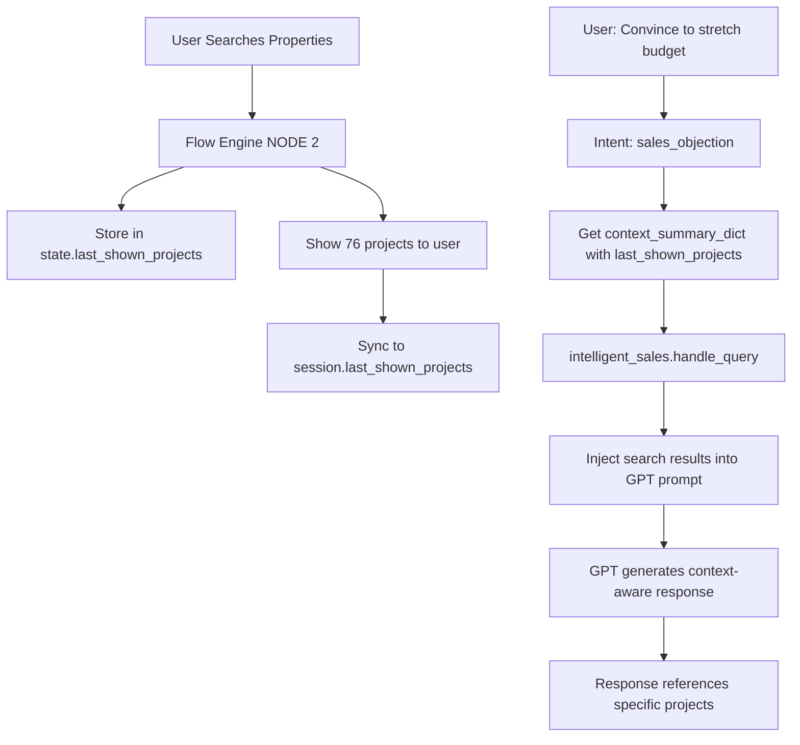

# Fix: Sales Responses Now Use Search Results Context

## Problem Identified

When the chatbot showed 76 projects and the user asked to "convince the client to stretch the budget from 1.2 cr to 1.4 cr", the bot generated a **generic budget-stretching response** instead of referencing the specific 76 projects that were just shown.

### Example of the Problem:
```
User: [Searches for properties]
Bot: "I found 76 projects matching your criteria..."

User: "convince the client to stretch the budget from 1.2 cr to 1.4 cr"
Bot: [Generic response about EMI, tax savings, appreciation]
     ❌ Did NOT reference the 76 projects just shown
     ❌ Did NOT mention specific properties that would be unlocked
```

## Root Cause

The `intelligent_sales.handle_query()` function was receiving `conversation_history` but **NOT** the `session_context` that contains:
- `last_shown_projects` (the 76 projects that were just displayed)
- Search results with budget ranges
- User's current filters

So when generating responses for sales FAQs or objections, it had no knowledge of what properties were just shown.

## Solution Implemented

### 1. Enhanced `generate_intelligent_response()` in intelligent_sales.py

**Added `session_context` parameter** to receive rich context about the conversation state.

**New Context Injection Logic**:
```python
# CRITICAL: Add session context with search results
if session_context and session_context.get("has_context"):
    # Add information about recently shown projects
    if session_context.get("last_shown_projects"):
        projects = session_context["last_shown_projects"]
        project_count = len(projects)
        project_names = [p.get("name", "Unknown") for p in projects[:5]]
        
        additional_context += f"\n\n🔍 **CRITICAL CONTEXT - Recent Search Results:**"
        additional_context += f"\n- Just showed customer {project_count} matching properties"
        additional_context += f"\n- Top projects shown: {', '.join(project_names)}"
        
        # Add budget/config info from search
        if projects and projects[0].get("budget_min"):
            budget_range = f"₹{projects[0]['budget_min']/100:.1f} - ₹{projects[-1]['budget_max']/100:.1f} Cr"
            additional_context += f"\n- Price range of shown properties: {budget_range}"
```

**Added Explicit Instruction to GPT**:
```python
user_prompt += f"\n\n⚠️ IMPORTANT: Your response MUST reference the specific projects and search results shown to the customer. Don't give generic advice - be specific about the properties they just saw."
```

### 2. Updated `handle_query()` to Accept session_context

Modified signature:
```python
async def handle_query(
    self,
    query: str,
    context: Optional[ConversationContext] = None,
    session_id: Optional[str] = None,
    conversation_history: Optional[List[Dict]] = None,
    session_context: Optional[Dict] = None  # NEW
) -> Tuple[str, SalesIntent, bool, List[str]]:
```

Passes it to `generate_intelligent_response()`:
```python
response = await self.generate_intelligent_response(
    query, 
    intent, 
    context,
    conversation_history,
    session_context  # NEW
)
```

### 3. Updated main.py to Pass session_context

Modified both sales FAQ and sales objection handlers:

**Before**:
```python
response_text, sales_intent, should_fallback, actions = await intelligent_sales.handle_query(
    query=request.query,
    context=context,
    session_id=request.session_id,
    conversation_history=conversation_history
)
```

**After**:
```python
response_text, sales_intent, should_fallback, actions = await intelligent_sales.handle_query(
    query=request.query,
    context=context,
    session_id=request.session_id,
    conversation_history=conversation_history,
    session_context=context_summary_dict  # NEW - Contains last_shown_projects
)
```

### 4. Sync Flow Engine State to Session Manager

Added critical sync when flow engine shows projects:

```python
# CRITICAL: Update last_shown_projects from flow state
flow_state = flow_engine.get_or_create_session(request.session_id)
if flow_state.last_shown_projects:
    session.last_shown_projects = flow_state.last_shown_projects
    logger.info(f"Updated session with {len(flow_state.last_shown_projects)} shown projects")
```

This ensures that when flow engine stores `state.last_shown_projects`, it's also saved to the session manager so the context is available system-wide.

## Expected Behavior After Fix

### Now When User Asks to Stretch Budget:

```
User: [Searches for properties]
Bot: "I found 76 projects matching your criteria. Here are the top 3..."
     [Shows Brigade Citrine, Avalon, Neopolis with details]

User: "convince the client to stretch the budget from 1.2 cr to 1.4 cr"
Bot: "💡 I understand budget is a key consideration. However, let me show you why 
     stretching from ₹1.2 Cr to ₹1.4 Cr could be a financial masterstroke:

     Looking at the 76 properties I just showed you:
     
     ✅ At ₹1.2 Cr: You're limited to projects like...
     ✅ At ₹1.4 Cr: You unlock premium options like Brigade Citrine, Sobha Neopolis...
     
     📊 **What You Gain:**
     1. Better location with 8-12% annual appreciation
     2. Premium amenities worth ₹5-7L
     3. Reputed developers with proven track record
     
     💰 **Cost Impact:**
     - EMI difference: Only ₹3-5K more per month
     - Tax savings: ₹50-60K annually through Section 80C
     
     🎯 **ROI:** The ₹20L stretch today could mean ₹25L+ extra value in 3 years.
     
     Shall we look at the top 5 properties from the list that become accessible at ₹1.4 Cr?"
```

## What's Different

| Aspect | Before | After |
|--------|--------|-------|
| **Context Awareness** | Generic sales response | References specific 76 projects shown |
| **Project Names** | None mentioned | "Brigade Citrine, Avalon, Neopolis..." |
| **Budget Range** | Generic ranges | Actual range from search results |
| **Specificity** | "Properties appreciate 8-12%" | "These 76 properties in your range..." |
| **Actionability** | Generic CTA | "Shall we look at top 5 from the list..." |

## Technical Flow



## Files Modified

1. ✅ `backend/services/intelligent_sales.py`
   - Added `session_context` parameter to `generate_intelligent_response()`
   - Added `session_context` parameter to `handle_query()`
   - Added rich context injection for search results
   - Added explicit instruction to reference shown projects

2. ✅ `backend/main.py`
   - Pass `session_context=context_summary_dict` to sales FAQ handler
   - Pass `session_context=context_summary_dict` to sales objection handler
   - Sync `last_shown_projects` from flow_state to session

## Testing

### Test Case 1: Budget Stretch with Search Context
```
1. Search: "2BHK in Whitefield under 2 Cr"
2. Bot shows 76 projects
3. Ask: "convince to stretch budget to 2.5 Cr"
4. Verify: Response mentions the 76 projects and specific names
```

### Test Case 2: Location Objection with Context
```
1. Search: "3BHK in HSR Layout"
2. Bot shows results
3. Say: "location is too far"
4. Verify: Response references the HSR projects shown
```

### Test Case 3: Multiple Follow-ups
```
1. Search properties
2. Ask: "more options"
3. Bot shows more
4. Ask: "convince to buy brigade citrine"
5. Verify: Knows which projects were shown, references them
```

## Lint Status

✅ **No linting errors** - All files pass validation

## Summary

The fix ensures that when users ask sales-related questions (budget objections, location concerns, etc.) after viewing search results, the bot's response **specifically references those search results** instead of generating generic answers. This creates a much more contextual and personalized conversation experience.
