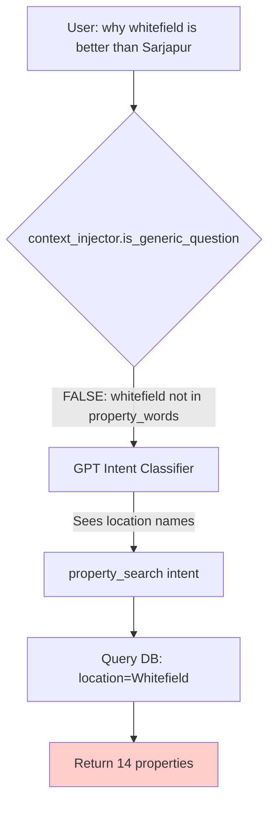
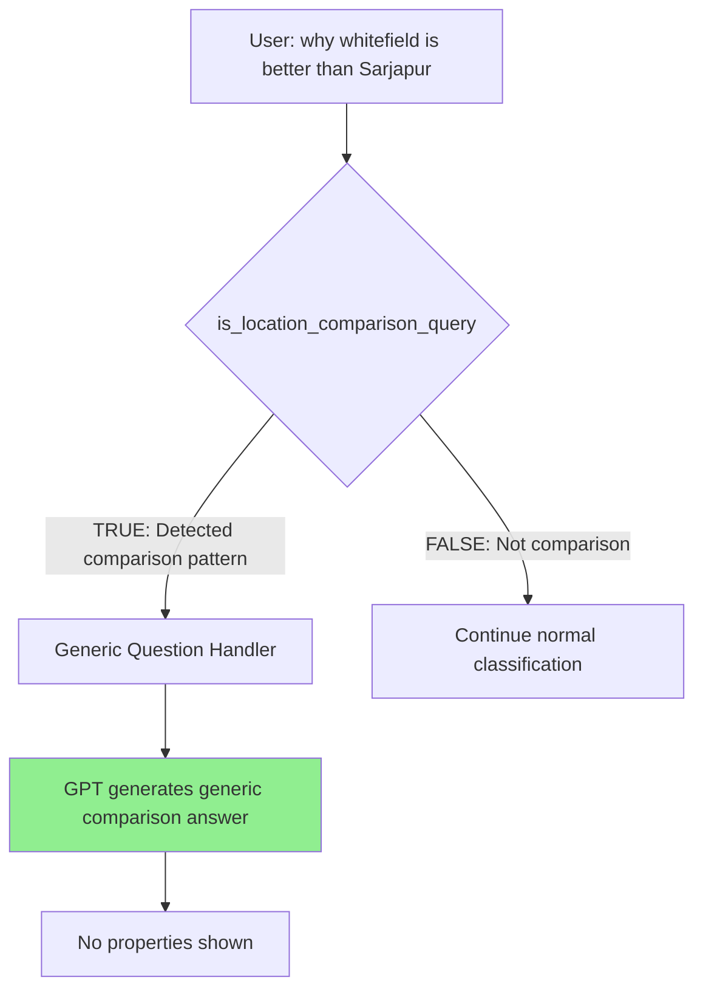

# Plan: Handle Location Comparison Questions as Generic

## Problem

Query: **"why whitefield is better than Sarjapur"** is being classified as `property_search` and showing 14 properties, when it should be treated as a **generic question** and receive a generic location comparison answer.

## Root Cause Analysis

### Current Flow (Broken)



### Why It's Broken

1. **context_injector.py line 66-67**: `property_words` list only has project names (brigade, sobha), NOT location names (whitefield, sarjapur)
2. **is_generic_question() line 75**: Returns `False` because query doesn't match the strict patterns
3. **intent_classifier.py line 151**: Only checks for developer names, not location comparisons
4. **GPT Intent Classifier**: No examples for location comparison questions, so it sees "whitefield" + "sarjapur" and classifies as property_search

## Solution

Detect **location comparison patterns** early and treat them as **generic questions**, preventing property search classification.

### Target Flow (Fixed)



## Implementation Plan

### 1. Update context_injector.py - Add Location Comparison Detection

**File**: [backend/services/context_injector.py](backend/services/context_injector.py)

**Add new function** after line 39 (after GENERIC_PATTERNS):

```python
# Bangalore location names for comparison detection
BANGALORE_LOCATIONS = [
    "whitefield", "sarjapur", "electronic city", "hebbal", "yeshwantpur",
    "koramangala", "indiranagar", "jayanagar", "hsr", "btm", "marathahalli",
    "bellandur", "outer ring road", "bannerghatta", "hennur", "yelahanka",
    "devanahalli", "kengeri", "jp nagar", "mg road", "brigade road",
    "rajajinagar", "malleshwaram", "basavanagudi", "kr puram", "varthur",
    "chandapura", "hosur road", "old madras road", "tumkur road", "mysore road",
    "kanakpura road", "north bangalore", "south bangalore", "east bangalore",
    "west bangalore", "central bangalore"
]

def is_location_comparison_query(query: str) -> bool:
    """
    Detect if query is comparing locations/areas (should be generic).
    
    Examples:
    - "why whitefield is better than Sarjapur"
    - "Whitefield vs Sarjapur"
    - "which is better whitefield or sarjapur"
    - "why should I buy in whitefield"
    - "is whitefield location good"
    - "tell me about whitefield area"
    
    Returns True for location comparison questions.
    """
    query_lower = query.lower().strip()
    
    # Check if query mentions any Bangalore locations
    has_location = any(loc in query_lower for loc in BANGALORE_LOCATIONS)
    
    if not has_location:
        return False
    
    # Pattern 1: "X vs Y", "X or Y", "better than", "compared to"
    comparison_patterns = [
        " vs ", " versus ", " or ", "better than", "compared to",
        "difference between", "compare", "comparison"
    ]
    if any(pattern in query_lower for pattern in comparison_patterns):
        return True
    
    # Pattern 2: "why should I buy in X", "is X good", "tell me about X area"
    area_info_patterns = [
        "why should i buy in", "is .* good", "is .* better",
        "tell me about .* area", "tell me about .* location",
        "why .* is good", "why .* is better"
    ]
    for pattern in area_info_patterns:
        if re.search(pattern, query_lower):
            return True
    
    # Pattern 3: "why X better/good" (without explicit property mention)
    if "why" in query_lower and has_location:
        if "better" in query_lower or "good" in query_lower or "best" in query_lower:
            # Make sure it's not about a specific project
            # "why Brigade Citrine is better" should NOT match
            # "why Whitefield is better" SHOULD match
            project_indicators = ["brigade", "sobha", "prestige", "godrej", 
                                "citrine", "avalon", "neopolis", "project"]
            if not any(proj in query_lower for proj in project_indicators):
                return True
    
    return False
```

**Update is_generic_question()** at line 42 - Add location comparison check:

```python
def is_generic_question(query: str) -> bool:
    """
    Check if query is a generic question that shouldn't use project context.
    """
    # NEW: Check for location comparison first
    if is_location_comparison_query(query):
        return True
    
    # ... existing logic ...
```

### 2. Update gpt_intent_classifier.py - Add Anti-Property-Search Rules

**File**: [backend/services/gpt_intent_classifier.py](backend/services/gpt_intent_classifier.py)

**Update system prompt** around line 135 - Add new rule:

In the intent classification section, add:

```
- location_comparison: User asks "why X is better than Y" for locations (NOT projects) - e.g. "why Whitefield is better than Sarjapur"
```

And add critical rule:

```
**CRITICAL - LOCATION COMPARISON DETECTION:**
- "why whitefield is better than sarjapur" → This is a GENERIC location comparison, NOT property_search
- "whitefield vs sarjapur" → Generic comparison, NOT property_search
- "is whitefield good for investment" → Generic location question, NOT property_search
- "why should I buy in whitefield" → Generic location question, NOT property_search
- ONLY classify as property_search if user explicitly asks to "show", "find", "list" properties
```

**Add example** around line 240:

```
Query: "why whitefield is better than sarjapur"
```json
{
  "intent": "unsupported",
  "data_source": "gpt_generation",
  "confidence": 0.95,
  "reasoning": "Location comparison question - should receive generic answer, not property list",
  "extraction": {}
}
```

### 3. Update main.py - Route Location Comparisons to GPT

**File**: [backend/main.py](backend/main.py)

**Add check** after Step 1.5 (factual query interceptor), around line 430:

```python
# Step 1.6: LOCATION COMPARISON QUERY INTERCEPTOR
from services.context_injector import is_location_comparison_query

if is_location_comparison_query(original_query):
    logger.info(f"Detected location comparison query: {original_query}")
    
    # Generate generic comparison answer using GPT
    from services.gpt_content_generator import generate_contextual_response_with_full_history
    
    response_text = generate_contextual_response_with_full_history(
        query=original_query,
        conversation_history=conversation_history if session else [],
        session_context={},
        goal="Provide a generic, informative comparison of Bangalore locations/areas. Discuss factors like connectivity, IT hub proximity, infrastructure, appreciation potential, and lifestyle. Keep it neutral and educational, NOT project-specific. End with: 'Would you like to explore properties in any of these areas?'"
    )
    
    # Update session
    if session:
        session_manager.add_message(request.session_id, "user", original_query)
        session_manager.add_message(request.session_id, "assistant", response_text[:500])
        session.last_intent = "location_comparison_generic"
        session_manager.save_session(session)
    
    response_time_ms = int((time.time() - start_time) * 1000)
    
    return ChatQueryResponse(
        answer=response_text,
        sources=[],
        confidence="High",
        intent="location_comparison_generic",
        refusal_reason=None,
        response_time_ms=response_time_ms,
        suggested_actions=["Explore properties in these areas", "Learn about other locations", "Get personalized recommendations"]
    )
```

## Expected Behavior After Fix

### Test Case 1: Location Comparison

```
User: "why whitefield is better than Sarjapur"

Bot: "Great question! Let me break down the key differences between Whitefield and Sarjapur:

**Whitefield:**
- Established IT hub with mature infrastructure
- Excellent connectivity via metro and ORR
- Premium social infrastructure (schools, hospitals, malls)
- Higher property prices but stable appreciation
- Ideal for IT professionals working in East Bangalore

**Sarjapur:**
- Emerging IT corridor with rapid development
- Growing infrastructure (upcoming metro extension)
- More affordable compared to Whitefield
- Higher appreciation potential due to development
- Good for long-term investment

Both locations have their advantages depending on your priorities - budget, commute, or appreciation potential.

Would you like to explore properties in any of these areas?"
```

### Test Case 2: Area Info Request

```
User: "is whitefield good for investment"

Bot: "Whitefield has been one of Bangalore's most sought-after investment destinations. Here's why:

- Strong IT presence (Tech parks, corporate offices)
- Excellent connectivity (Metro, ORR, Airport proximity)
- Premium social infrastructure
- Steady rental demand
- Consistent appreciation (8-10% annually)

It's particularly suitable if you're looking for:
- Ready rental income
- Low vacancy risk
- Stable long-term appreciation

Would you like to explore properties in Whitefield?"
```

### Test Case 3: Should NOT Affect Project Searches

```
User: "show me 2bhk in whitefield under 2cr"

Bot: [Shows 14 properties] ✅ Works as before
```

## Files to Modify

1. [backend/services/context_injector.py](backend/services/context_injector.py) - Add location comparison detection
2. [backend/services/gpt_intent_classifier.py](backend/services/gpt_intent_classifier.py) - Add anti-property-search rules
3. [backend/main.py](backend/main.py) - Add location comparison interceptor

## Success Criteria

- "why whitefield is better than sarjapur" → Generic comparison answer, NO properties shown
- "whitefield vs sarjapur" → Generic comparison answer
- "is whitefield good" → Generic location info answer
- "why should I buy in whitefield" → Generic location benefits answer
- "show me properties in whitefield" → Still shows properties (normal search)
- "2bhk in whitefield" → Still shows properties (normal search)

## Summary

The fix prevents location comparison questions from triggering property searches by:
1. Detecting location comparison patterns early
2. Routing them to GPT for generic answers
3. Never querying the database for these queries
4. Maintaining normal property search behavior for explicit search requests
