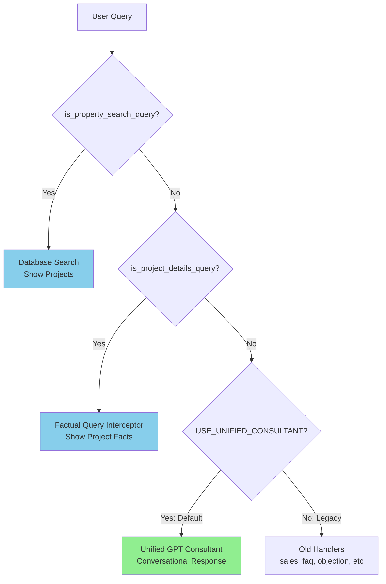

# 🔍 REANALYSIS: The REAL Problem

## Critical Discovery

**THE UNIFIED CONSULTANT IS ALREADY IMPLEMENTED!**

I missed this in my first analysis. Looking at the code:

- **Line 652**: `USE_UNIFIED_CONSULTANT = os.getenv("USE_UNIFIED_CONSULTANT", "true")` → **ENABLED BY DEFAULT**
- **Lines 703-744**: Unified GPT consultant routing
- **`gpt_sales_consultant.py`**: Full implementation (356 lines)

## Current Flow (As It Should Be Working)



## So Why Isn't It ChatGPT-Like?

Since the unified consultant IS enabled, the problem must be one of these:

### Problem 1: Intent Classification Too Strict
The intent classifier may be routing things to property_search or project_details when they should go to the GPT consultant.

### Problem 2: GPT Consultant Prompt Not Optimized
The consultant prompt might not be strong enough to maintain continuous conversation.

### Problem 3: Session Context Not Rich Enough
The context passed to GPT might be missing key information.

### Problem 4: Feature Disabled in Production
The environment variable might be set to "false" in production.

## Let Me Check What's Actually Failing

Looking at your screenshot errors and requirements:

### Your Requirements:
1. ✅ **Property search with requirements** → Database (should work)
2. ✅ **Project details** → Database (should work)
3. ❌ **Everything else** → Should use GPT consultant (might not be working)

### Likely Issues:

#### Issue 1: Too Many Queries Going to `property_search`
```python
def is_property_search_query(query: str, intent: str, filters: Optional[Dict] = None) -> bool:
    """Check if this is a property search query."""
    # May be too broad - catching queries that should go to GPT
```

#### Issue 2: Too Many Queries Going to `more_info_request` → `flow_engine`
Line 1046:
```python
if intent in ["sales_pitch", "project_fact", "project_details", "comparison", 
              "sales_faq", "more_info_request"]:
    logger.info(f"Routing intent '{intent}' to Flow Engine")  # BYPASSES GPT CONSULTANT!
```

**THIS IS THE PROBLEM!** 🚨

Even with unified consultant enabled, these intents STILL route to flow_engine instead of the GPT consultant!

## The Real Problem

**Lines 1044-1102**: Legacy routing that bypasses the unified consultant for certain intents!

```python
# Line 1046: This runs EVEN IF unified consultant is enabled!
if intent in ["sales_pitch", "project_fact", "project_details", "comparison", 
              "sales_faq", "more_info_request"]:
    # Routes to flow_engine instead of GPT consultant
    flow_response = execute_flow(...)
```

### Why This Breaks Everything:

1. User asks: "What's the expected appreciation?" 
2. GPT classifies as: `sales_faq`
3. Should route to: Unified GPT consultant
4. Actually routes to: **flow_engine** (rigid decision tree)
5. Result: Scripted response, breaks conversation

## The Fix

### Option A: Remove Legacy Routing Completely
Delete or disable the flow_engine routing block (lines 1044-1102) so ALL non-search/non-details queries go to unified consultant.

### Option B: Make Flow Engine Respect Feature Flag
```python
# Only use flow_engine if unified consultant is disabled
if not USE_UNIFIED_CONSULTANT and intent in ["sales_pitch", "project_fact", ...]:
    flow_response = execute_flow(...)
```

### Option C: Simplify Intent Classification
Reduce intents to just 3:
- `property_search`
- `project_details` 
- `sales_conversation` (everything else)

## Recommended Solution

**REMOVE the flow_engine bypass** (lines 1044-1102). Let the unified consultant handle ALL conversational intents.

### Why This Will Work:

1. ✅ Property searches still go to database (lines 655-693)
2. ✅ Project details still use factual interceptor (lines 388-473)
3. ✅ Everything else goes to unified GPT consultant (lines 705-744)
4. ✅ No more rigid decision trees breaking conversation flow
5. ✅ True ChatGPT-like continuous conversation

## Summary

**The unified consultant exists and is enabled**, but the legacy flow_engine routing (lines 1044-1102) **hijacks** certain intents before they can reach the consultant.

**Solution**: Comment out or delete the flow_engine routing block.

Would you like me to implement this fix?
