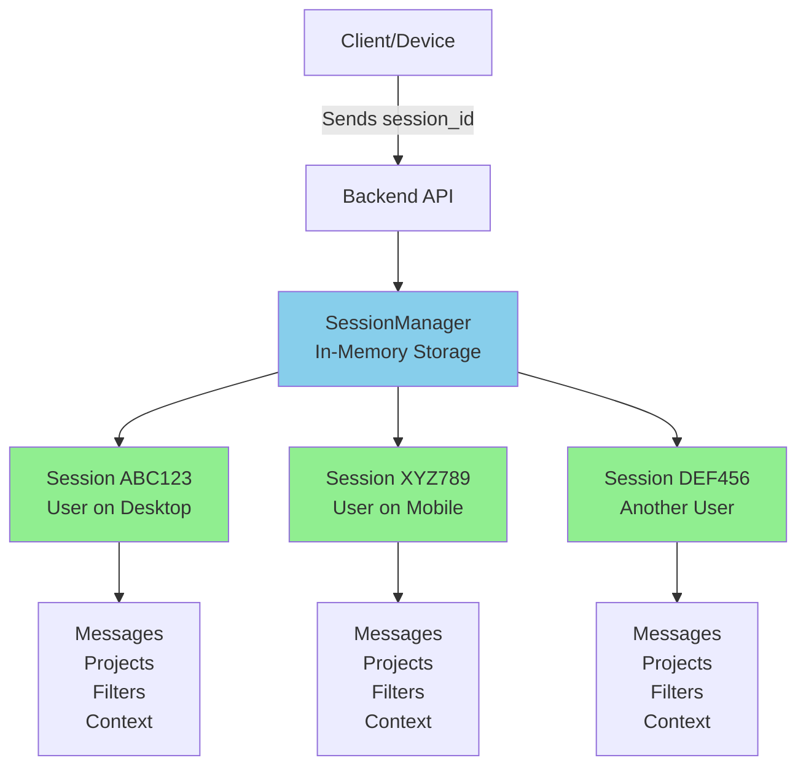

# Session Management Explanation

## How Sessions Work Currently

### Architecture Overview



## Current Implementation

### 1. Session ID Generation

**File**: `backend/services/session_manager.py` (Line 71)

```python
# Create new session
new_id = session_id or str(uuid.uuid4())[:8]
return self._create_session(new_id)
```

**How it works:**
- If client sends a `session_id` → Use that
- If no `session_id` provided → Generate random 8-character ID (e.g., `"a3b4c5d6"`)

### 2. Session Storage

**Location**: In-memory dictionary (RAM)

```python
class SessionManager:
    def __init__(self, session_timeout_minutes: int = 30):
        self.sessions: Dict[str, ConversationSession] = {}  # In-memory storage
        self.session_timeout = timedelta(minutes=session_timeout_minutes)
```

**What's stored per session:**
```python
class ConversationSession:
    session_id: str
    created_at: datetime
    last_activity: datetime
    
    # Conversation data
    messages: List[Dict]              # Last 10 messages
    current_filters: Dict             # Search criteria
    
    # Sales tracking
    objections_raised: List[str]      # Budget, location, etc.
    interested_projects: List[str]    # Project names
    
    # Context for continuous conversation
    last_intent: str                  # Last classified intent
    last_topic: str                   # Last discussed topic
    last_shown_projects: List[Dict]   # Recently shown properties
    conversation_phase: str           # discovery/evaluation/negotiation/closing
    
    # Engagement tracking
    engagement_score: int             # Increases with each interaction
    meeting_suggested: bool
    site_visit_suggested: bool
```

### 3. Session Timeout

**Default**: 30 minutes of inactivity

```python
# Line 64: Check if session expired
if datetime.now() - session.last_activity > self.session_timeout:
    logger.info(f"Session {session_id} expired, creating new one")
    return self._create_session(session_id)
```

## Answer to Your Questions

### Q1: "How sessions are handled now?"

**Answer**: **In-memory, temporary sessions**

- ✅ **Stored in RAM** (not database)
- ✅ **Last 30 minutes** after last activity
- ✅ **Lost on server restart** (not persistent)
- ✅ **Keyed by session_id** sent from client

**Flow:**
```
1. Client sends request with session_id="abc123"
2. Backend checks: Does session "abc123" exist in memory?
   - Yes → Load existing conversation history
   - No → Create new session
3. Process request with full context
4. Update session in memory
5. Return response
```

### Q2: "Different device will be different?"

**Answer**: **YES - Each device/browser gets its own session**

#### Scenario A: Same User, Different Devices

```
Desktop Browser:
- Generates session_id = "abc123"
- Conversation: "show me 2bhk in whitefield"
- Context stored in session "abc123"

Mobile Browser (Same User):
- Generates NEW session_id = "xyz789"  ← Different!
- Starts fresh conversation
- NO access to desktop conversation
- Separate context in session "xyz789"
```

**Result**: ❌ Conversations are NOT synced across devices

#### Scenario B: Same Device, Different Browsers

```
Chrome:
- session_id = "abc123"
- Full conversation history

Firefox (Same Computer):
- session_id = "def456"  ← Different!
- Fresh conversation
- NO shared history
```

**Result**: ❌ Conversations are NOT synced across browsers

#### Scenario C: Same Device, Same Browser (Ideal)

```
First Visit:
- session_id = "abc123" stored in browser localStorage
- Conversation history builds up

Return Visit (30 mins later):
- Browser sends same session_id = "abc123"
- ✅ Conversation continues seamlessly
```

**Result**: ✅ Conversation persists within same browser session

## Current Limitations

### ❌ Not Persistent
- **Server restart** → All sessions lost
- **No database storage** → Can't recover history
- **Can't view old conversations** after timeout

### ❌ Not Cross-Device
- **Different devices** → Separate conversations
- **Can't switch devices** mid-conversation
- **No user account system** → Can't link sessions

### ❌ Limited Duration
- **30-minute timeout** → Session expires
- **After timeout** → New session, loses context
- **No long-term memory** → Can't remember user preferences across days

## How Client Should Handle session_id

### Recommended Implementation (Frontend)

```javascript
// On first load
let sessionId = localStorage.getItem('chatbot_session_id');

if (!sessionId) {
    // Generate new session ID
    sessionId = generateRandomId(); // e.g., "a3b4c5d6"
    localStorage.setItem('chatbot_session_id', sessionId);
}

// Send with every request
fetch('/api/chat/query', {
    method: 'POST',
    body: JSON.stringify({
        query: userMessage,
        session_id: sessionId  // ← Same ID for continuous conversation
    })
});
```

### What Happens:

1. **First Visit**: Generate `session_id`, store in localStorage
2. **Every Message**: Send same `session_id`
3. **Backend**: Loads conversation context, maintains continuity
4. **Close Tab**: `session_id` stays in localStorage
5. **Reopen Tab**: Use same `session_id`, conversation continues (if <30min)

## Upgrade Paths (For Future)

### Option 1: Add User Accounts
```python
class ConversationSession:
    user_id: Optional[str]  # Link to user account
    device_id: Optional[str]  # Track device
    
# Then sync sessions across devices for same user_id
```

### Option 2: Persist to Database
```python
# Save to PostgreSQL instead of memory
def save_session(session):
    db.sessions.upsert({
        "session_id": session.session_id,
        "user_id": session.user_id,
        "conversation_data": session.dict()
    })
```

### Option 3: Extend Timeout
```python
# Change from 30 minutes to longer
SessionManager(session_timeout_minutes=1440)  # 24 hours
```

## Summary

### Current State:

| Aspect | Status |
|--------|--------|
| **Storage** | In-memory (RAM) ❌ |
| **Persistence** | Lost on restart ❌ |
| **Duration** | 30 minutes ⚠️ |
| **Cross-Device** | No ❌ |
| **Cross-Browser** | No ❌ |
| **Within Browser** | Yes ✅ |

### How It Works:

1. **Client generates or stores `session_id`** in localStorage
2. **Sends `session_id` with every request**
3. **Backend maintains session in memory** for 30 minutes
4. **Each device/browser = separate session** (independent conversations)
5. **Same browser = continuous conversation** (as long as <30min between messages)

### Key Takeaway:

✅ **Same device, same browser**: Conversation continues perfectly
❌ **Different device or browser**: Fresh conversation, no shared history
⚠️ **After 30 min idle**: Session expires, loses context

Would you like me to implement any of these upgrade paths (user accounts, database persistence, cross-device sync)?
