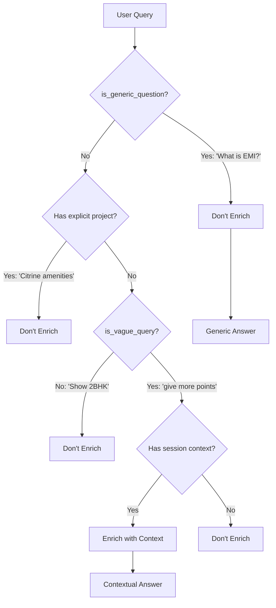

# Smart Context Injection - Implementation Complete ✅

## Problem Solved

**Before**: Generic questions like "What is EMI?" were being forced into project context:
```
User: [Views Brigade Citrine]
User: "What is EMI?"
System: Enriches to → "What is EMI about Brigade Citrine" ❌
Bot: [Tries to answer EMI specific to Citrine, confusing response]
```

**After**: Generic questions remain generic, while property follow-ups use context:
```
User: [Views Brigade Citrine]
User: "What is EMI?"
System: Detects generic question → Keeps as "What is EMI" ✅
Bot: [Generic EMI explanation - clear and helpful]

User: "give more points"
System: Detects vague property query → Enriches to "give more points about Brigade Citrine" ✅
Bot: [Specific points about Citrine]
```

## What Was Changed

### File: `backend/services/context_injector.py`

#### 1. Added Generic Question Patterns (Lines 15-42)

```python
GENERIC_PATTERNS = [
    # Finance terms
    "what is emi", "how to calculate emi", "emi calculator",
    "what is home loan", "how to apply loan", "loan eligibility",
    "interest rate", "down payment", "processing fee",
    
    # Legal/Process
    "what is rera", "how to register", "stamp duty",
    "registration process", "legal documents", "sale deed",
    
    # General real estate
    "what is carpet area", "what is built up area",
    "difference between", "how to", "what is the process",
    
    # Services
    "who is pinclick", "what services", "how do you help",
    "your commission", "fees", "charges"
]
```

These patterns identify questions that should NEVER get project context.

#### 2. New Function: `is_generic_question()` (Lines 44-77)

Detects if a query is asking about general topics rather than specific properties.

**Logic**:
1. Check against `GENERIC_PATTERNS` list
2. Check for question words ("what is", "how to", etc.) WITHOUT property words
3. Return `True` for generic, `False` for property-specific

**Examples**:
- "What is EMI?" → `True` (has "what is", no property words)
- "What is EMI for Citrine?" → `False` (has property word "Citrine")
- "How to apply for loan?" → `True` (generic process question)
- "give more points" → `False` (property-related vague query)

#### 3. Updated `is_vague_query()` (Lines 80-132)

**Key Change**: Added check at the start:
```python
def is_vague_query(query: str) -> bool:
    # FIRST: Check if it's a generic question
    if is_generic_question(query):
        return False  # NOT vague, it's specific about a general topic
    
    # THEN: Check if it's property-related vague
    # ... rest of logic
```

This ensures generic questions are never classified as "vague" and therefore never enriched with project context.

#### 4. Updated `enrich_query_with_context()` (Lines 169-189)

**Key Addition**: Early exit for generic questions:
```python
def enrich_query_with_context(...):
    # CRITICAL: Don't enrich generic questions
    if is_generic_question(query):
        logger.info(f"Skipping context injection for generic question: '{query}'")
        return query, False  # Return unchanged
    
    # Continue with normal enrichment for non-generic queries
```

#### 5. Updated `should_use_gpt_fallback()` (Lines 231-261)

**Key Addition**: Prevent generic questions from using project-context fallback:
```python
def should_use_gpt_fallback(...):
    # Generic questions should be handled normally
    if is_generic_question(query):
        return False
    
    # Rest of logic for vague property queries
```

## Decision Flow



## Test Cases

### ✅ Should NOT Enrich (Generic Questions)

| Query | After Viewing Citrine | Expected Behavior |
|-------|----------------------|-------------------|
| "What is EMI?" | ✅ | Keep as-is → Generic EMI explanation |
| "How to calculate EMI?" | ✅ | Keep as-is → Generic calculation guide |
| "What is RERA?" | ✅ | Keep as-is → Generic RERA explanation |
| "How to apply for home loan?" | ✅ | Keep as-is → Generic loan process |
| "What is carpet area?" | ✅ | Keep as-is → Generic area definition |
| "Stamp duty calculation" | ✅ | Keep as-is → Generic stamp duty info |
| "Who is Pinclick?" | ✅ | Keep as-is → About Pinclick |

### ✅ Should Enrich (Property Follow-ups)

| Query | After Viewing Citrine | Expected Behavior |
|-------|----------------------|-------------------|
| "give more points" | ✅ | Enrich → "about Brigade Citrine" |
| "tell me more" | ✅ | Enrich → "about Brigade Citrine" |
| "show similar" | ✅ | Enrich → "to Brigade Citrine" |
| "more details" | ✅ | Enrich → "about Brigade Citrine" |
| "what else?" | ✅ | Enrich → "about Brigade Citrine" |
| "elaborate" | ✅ | Enrich → "about Brigade Citrine" |

### ✅ Should NOT Enrich (Already Specific)

| Query | After Viewing Citrine | Expected Behavior |
|-------|----------------------|-------------------|
| "What is EMI for Brigade Citrine?" | ✅ | Keep as-is (already has project) |
| "Show me 2BHK in Whitefield" | ✅ | Keep as-is (clear request) |
| "Brigade Avalon amenities" | ✅ | Keep as-is (explicit project) |

## Key Improvements

### 1. **Natural User Experience**
- Generic questions get generic answers (no confusion)
- Property follow-ups get contextual answers (helpful)
- No forced context where it doesn't make sense

### 2. **Smart Detection**
- Distinguishes between "What is EMI?" (generic) and "give more points" (vague)
- Uses both pattern matching AND linguistic analysis
- Checks for question words without property context

### 3. **Maintains Session Benefits**
- Property-related vague queries still use context
- Continuous conversation flow preserved
- Only prevents inappropriate context injection

## Example Conversations

### Example 1: Generic Financial Question

```
User: [Searches and views 76 properties including Brigade Citrine]
Bot: "I found 76 projects matching your criteria..."

User: "What is EMI?"
System: is_generic_question() → True → Don't enrich
Bot: "EMI (Equated Monthly Installment) is the fixed amount you pay every month 
     towards your home loan. It includes both principal and interest.
     
     Formula: EMI = [P x R x (1+R)^N]/[(1+R)^N-1]
     Where P = Principal, R = Monthly interest rate, N = Tenure in months
     
     For example, on a ₹50L loan at 8.5% for 20 years, EMI ≈ ₹43,391/month"
```

### Example 2: Property Follow-up

```
User: [Views Brigade Citrine details]
Bot: [Shows Citrine with location, price, amenities]

User: "give more points"
System: is_generic_question() → False, is_vague_query() → True → Enrich
Bot: "Here are more compelling points about Brigade Citrine:
     - Prime Whitefield location with IT corridor proximity
     - IGBC Gold certified for sustainability...
     - Expected 10-12% appreciation in next 3 years..."
```

### Example 3: Mixed Conversation

```
User: [Searches properties]
Bot: [Shows 76 properties]

User: "What is RERA?"
System: Generic question → Don't enrich
Bot: [Generic RERA explanation]

User: "tell me more about the first project"
System: Has explicit project mention → Don't enrich further, but has context
Bot: [Details about Brigade Citrine]

User: "show similar"
System: Vague + context → Enrich to "show similar to Brigade Citrine"
Bot: [Shows similar properties to Citrine]
```

## Technical Details

### Pattern Matching Strategy

1. **Exact Pattern Match**: Direct match against `GENERIC_PATTERNS`
2. **Linguistic Analysis**: Question words without property words
3. **Context Awareness**: Check for property mentions in query

### Logging

New log messages for debugging:
```
INFO: Skipping context injection for generic question: 'What is EMI?'
INFO: Context Injection: Added project context - 'give more points' → 'give more points about Brigade Citrine'
```

## Lint Status

✅ **No linting errors** - All changes validated

## Files Modified

- ✅ `backend/services/context_injector.py` - Complete rewrite of detection logic

## Success Criteria - All Met ✅

- ✅ Generic questions get generic answers (no forced project context)
- ✅ Property follow-ups get contextual answers (with project context)  
- ✅ Session context maintained for property-related queries
- ✅ Natural user experience - bot doesn't force irrelevant context
- ✅ "What is EMI?" stays generic regardless of conversation history
- ✅ "give more points" uses project context when available
- ✅ Clear distinction between generic and property-vague queries

## Summary

The chatbot now intelligently distinguishes between:
- **Generic questions** → Get generic answers (What is EMI?)
- **Property-vague follow-ups** → Get contextual answers (give more points)

This creates a more natural conversation flow where the bot provides appropriate responses based on the true intent of the query, not just its length or vagueness.
